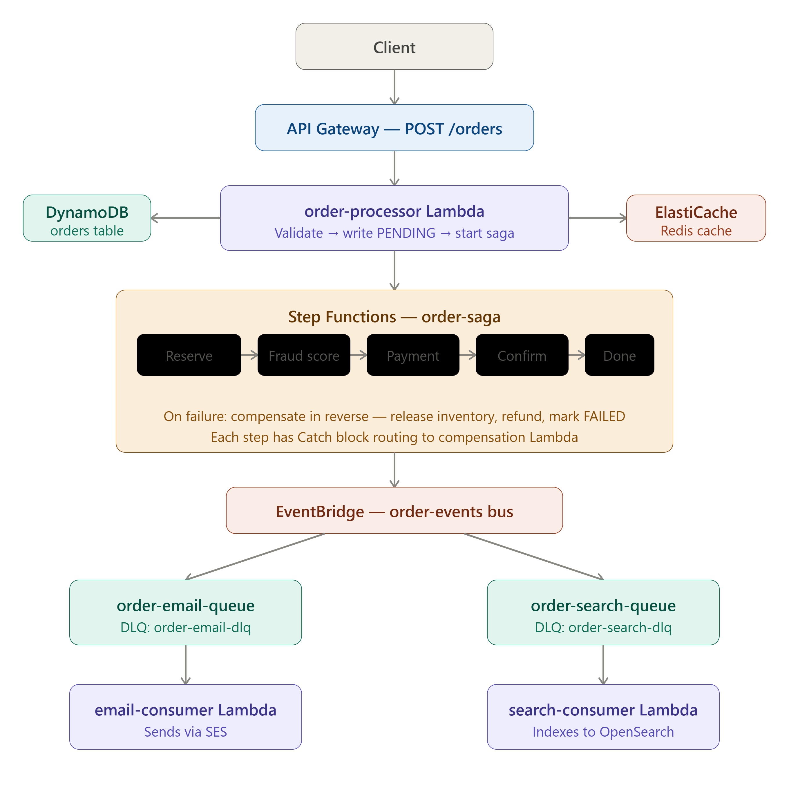

# Event-Driven Order Processing Platform on AWS

A production-style, event-driven order processing backend built on AWS serverless and managed services. Demonstrates saga pattern, event fanout, compensating transactions, and infrastructure-as-code.

## Architecture



### Services Used
- **API Gateway** — REST API entry point (POST /orders)
- **AWS Lambda** — order processing, saga steps, event consumers
- **DynamoDB** — orders, inventory, products tables
- **Step Functions** — saga orchestration with compensation
- **EventBridge** — event bus for order confirmed events
- **SQS** — two queues (email, search) with DLQs
- **SES** — order confirmation emails
- **OpenSearch** — order search index
- **ElastiCache (Redis)** — product cache on read path
- **IAM** — least-privilege roles per service
- **Terraform** — provisions OpenSearch + ElastiCache

## Flow

1. Client sends `POST /orders` to API Gateway
2. `order-processor` Lambda validates and writes order to DynamoDB (`PENDING`)
3. Step Functions saga starts:
   - Reserve inventory (conditional check on stock)
   - Score fraud (placeholder for Bedrock integration)
   - Process payment (simulated, 90% success)
   - Confirm order → updates DynamoDB (`CONFIRMED`) → publishes to EventBridge
4. EventBridge fans out to two SQS queues simultaneously
5. `email-consumer` Lambda sends confirmation email via SES
6. `search-consumer` Lambda indexes order into OpenSearch

### Saga Compensation
| Failure point | Compensation |
|---|---|
| Reserve inventory fails | → FailOrder directly |
| Payment fails | → Release inventory → FailOrder |
| Confirm fails | → Release inventory → FailOrder |

## Prerequisites

- AWS account with admin access
- AWS CLI configured (`aws configure`)
- Terraform >= 1.0
- Python 3.12
- curl (for testing)

## Setup

### Phase 1 — DynamoDB + Lambda + API Gateway

1. Create three DynamoDB tables (on-demand capacity):
   - `orders` — partition key: `orderId` (String)
   - `inventory` — partition key: `productId` (String)
   - `products` — partition key: `productId` (String)

2. Seed `inventory` and `products` tables with test data (see `docs/seed-data.json`)

3. Create IAM role `order-lambda-role` with:
   - `AWSLambdaBasicExecutionRole`
   - Inline policy for DynamoDB, SQS, SES, EventBridge (see `docs/iam-policies.json`)

4. Create Lambda function `order-processor` (Python 3.12, `order-lambda-role`)
   - Set environment variables: `REDIS_ENDPOINT`, `VERIFIED_EMAIL`
   - Set environment variables: `STATE_MACHINE_ARN`, `arn:aws:states:REGION:ACCOUNT_ID:stateMachine:order-saga`
   - Deploy code from `lambdas/order-processor/`

5. Create REST API in API Gateway:
   - Resource: `/orders`
   - Method: POST with Lambda proxy integration → `order-processor`
   - Deploy to stage: `dev`

6. Test:
```bash
curl -X POST https://YOUR_API_URL/dev/orders \
  -H "Content-Type: application/json" \
  -d '{"customerId": "CUST001", "customerEmail": "your@email.com", "items": [{"productId": "PROD001", "name": "Wireless Headphones", "price": 99, "quantity": 1}]}'
```

### Phase 2 — Step Functions Saga

1. Create saga Lambda functions (all use `order-lambda-role`, Python 3.12):
   - `reserve-inventory`
   - `process-payment`
   - `confirm-order` (set env var: `OPENSEARCH_ENDPOINT`)
   - `fail-order`
   - `release-inventory`

2. Create Step Functions state machine `order-saga`:
   - Use definition from `step-functions/order-saga.json`
   - Replace `REGION` and `ACCOUNT_ID` with your values
   - Let AWS auto-create the execution role

3. Test happy path and failure path via Step Functions console

### Phase 3 — EventBridge + SQS

1. Create EventBridge bus: `order-events`

2. Create SQS queues with DLQs:
   - `order-email-queue` → DLQ: `order-email-dlq` (max receives: 3)
   - `order-search-queue` → DLQ: `order-search-dlq` (max receives: 3)

3. Create EventBridge rules on `order-events` bus:
   - `order-confirmed-to-email` → target: `order-email-queue`
   - `order-confirmed-to-search` → target: `order-search-queue`
   - Event pattern:
```json
{
  "source": ["order.service"],
  "detail-type": ["ORDER_CONFIRMED"]
}
```

4. Create consumer Lambdas:
   - `email-consumer` → trigger: `order-email-queue`
   - `search-consumer` → trigger: `order-search-queue`, env var: `OPENSEARCH_ENDPOINT`

### Phase 4 — SES + OpenSearch + ElastiCache

1. Verify your email in SES sandbox

2. Provision OpenSearch + ElastiCache via Terraform:
```bash
cd terraform
cp terraform.tfvars.example terraform.tfvars
# Edit terraform.tfvars with your account ID
terraform init
terraform apply
```

3. Update Lambda environment variables with Terraform outputs:
   - `search-consumer`: `OPENSEARCH_ENDPOINT`
   - `order-processor`: `REDIS_ENDPOINT`

4. Update OpenSearch access policy to allow `order-lambda-role`

## Cost

| Service | Cost when idle |
|---|---|
| DynamoDB | $0 (on-demand) |
| Lambda | $0 (per invocation) |
| API Gateway | $0 (per request) |
| Step Functions | $0 (per execution) |
| EventBridge | $0 (per event) |
| SQS | $0 (per request) |
| SES | $0 (per email) |
| OpenSearch | ~$1/day (hourly billing) |
| ElastiCache | ~$0.50/day (hourly billing) |

**Teardown OpenSearch + ElastiCache when not in use:**
```bash
cd terraform
terraform destroy
```

## Repository Structure

```
├── lambdas/
│   ├── order-processor/
│   ├── reserve-inventory/
│   ├── process-payment/
│   ├── confirm-order/
│   ├── fail-order/
│   ├── release-inventory/
│   ├── email-consumer/
│   └── search-consumer/
├── step-functions/
│   └── order-saga.json
├── terraform/
│   ├── main.tf
│   ├── variables.tf
│   ├── outputs.tf
│   └── terraform.tfvars.example
└── docs/
    ├── architecture.png
    ├── seed-data.json
    └── iam-policies.json
```
## Author

Lokesh Mateti — [GitHub](https://github.com/lokesh-mateti)
